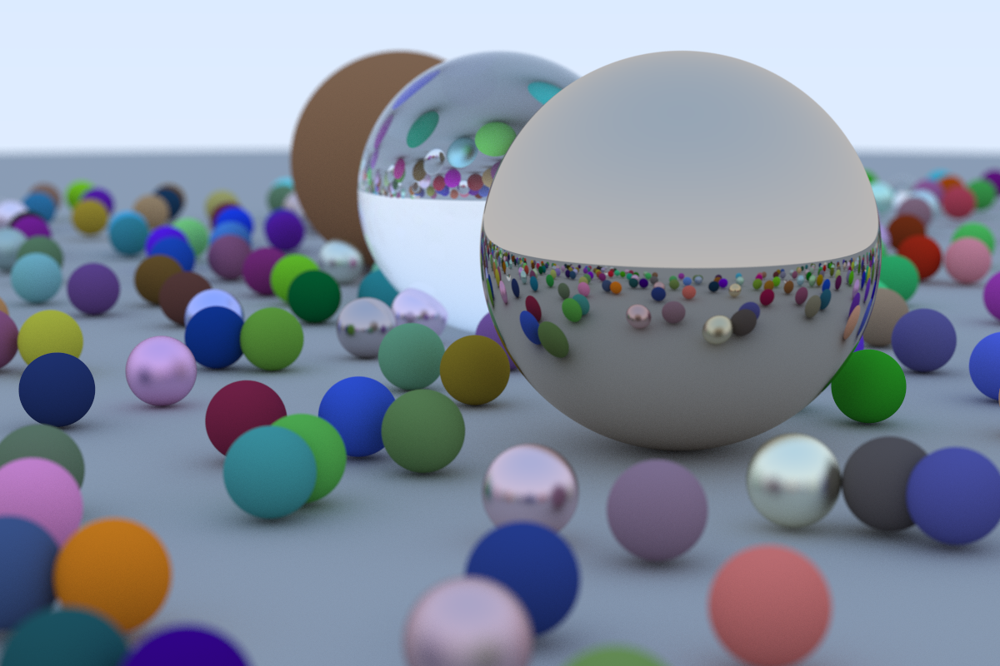

Adapting the raytracing project I did in Java to TypeScript.

Execution time (for the image below): **8h38min**. 
Aspect ratio: 3:2 | Image Width: 1200px | Samples per pixel: 500 | Max ray bounce: 50 | Number of spheres: 488

